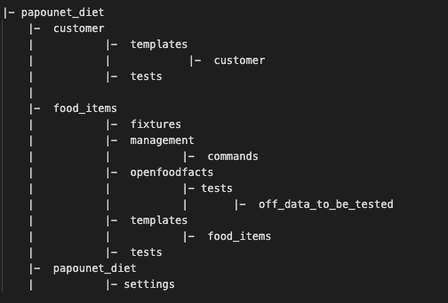

# Overall Framework
This project is developped in the framework of an education program as software developper in Python.

# Purpose
This web application offers the user to look for food items with better nutritional properties.

# Main Functionalities
- The user can create an account in order to get a better experience
- The user, be he anonymous or registered, is supposed to type in the name of a food item
- Then, the application looks for items of the same category with better nutritional properties
- The user can get more information on a selected product
- And he can subsequently record it

# This project is developped using :
- Python 3.8.1 
- Django 3.1.4

# Environments:
Different environments, named base, local and production have been developped.
To use papounet_diet in local mode, add the suffix:
**--settings papounet_super_diet.settings.local**
to your command line, be it for testing or running the server.

# Environment variables:
Environment variables (e.g. SECRET_KEY) are stored in a .env file, in the root folder of the project.
As they are not stored with the settings, you should create a .env file and store the SECRET_KEY over there.

# How to start the local server
- Create a virtual environment with python
- Install all the requirements, as listed in requirements.txt
- Make sure all the modules are installed.
- switch to papounet_diet module
- make migrations
- create a cache table
- run from the terminal: $ python manage.py runserver

## Testing:
### Commands for efficient testing
Using the Shell, type what the following command line, it will remove almost all irrelevant files.
As of 27.12.20, coverage rate reaches 85%

$ coverage run --omit='*/venv/*,*/tests/*,*/migrations/*,*/papounet_diet/tests.py,*/settings/*,*/manage.py,*/apps.py,*/admin.py'  manage.py test (+ local settings)

$ coverage report -m

### Where are the tests located ?
App customer: only basic testing as this module strictly follows Django guidelines.
App food_items:
- in module openfoodfacts, iot check the import of data through their API
- in apps food_items and customer iot check the views and the queries.
- in papounet_diet, you will find the Selenium functional tests, with two user stories.

# Flake8 implementation
Depending on your Python alias, just type:
$ python -m flake8
A tox.ini file has been implemented and is to be found a the root of the project.
It excludes from Flake checking:
- all lines needed for in a Django project
- urls

# Architecture
Only the folders are depicted.
This program follows a Django standard architecture.

# Cache
This project uses a cache using the database.
Therefore, upon deployment, you should create a cache table, immediately after creating database migration.
e.g. : $ heroku run python manage.py createcachetable

# Deployment
This project is conceived to be deployed with Heroku.
Therefore, you will find following files:
- Procfile
- runtime.txt

